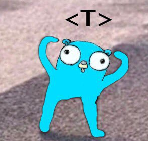

# Yet another cache


A golang in-memory caching library created for the purpose of learning and using it on my projects.

### Installation

```sh
go get -u github.com/xelbot/yetacache
```

### Usage

```go
package main

import (
	"fmt"
	"time"
	"github.com/xelbot/yetacache"
)

func main() {
	// create a new instance of cache
	//
	// minute - default TTL for new cache items,
	// hour - interval for automatically clearing
	// the cache of expired items.
	cache := yetacache.New[string, int](time.Minute, time.Hour)

	cache.Set("abc", 36, yetacache.DefaultTTL)
	cache.Set("def", 42, 5*time.Minute)

	_ = cache.Has("abc") // true
	_ = cache.Has("zzz") // false

	if abc, found := cache.Get("abc"); found {
		fmt.Println(abc) // print 36
	}

	// delete item by key
	cache.Delete("def")
	if _, found := cache.Get("def"); !found {
		fmt.Println("Not found deleted item")
	}

	// delete all items
	cache.Clear()
	if _, found := cache.Get("abc"); !found {
		fmt.Println("Not found deleted item")
	}

	// stops the internal cleanup cycle
	// that removes expired items.
	cache.StopCleanup()
}
```

### Docs

godoc or [http://godoc.org/github.com/xelbot/yetacache](http://godoc.org/github.com/xelbot/yetacache)

Powered by:


